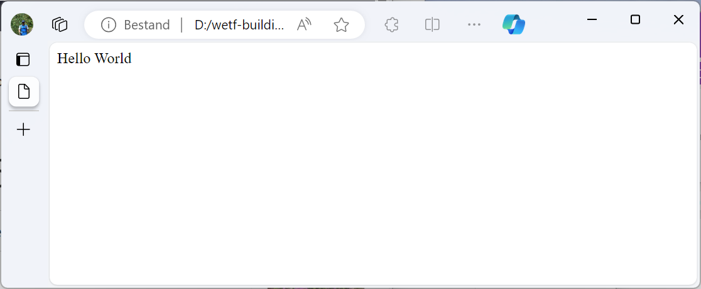
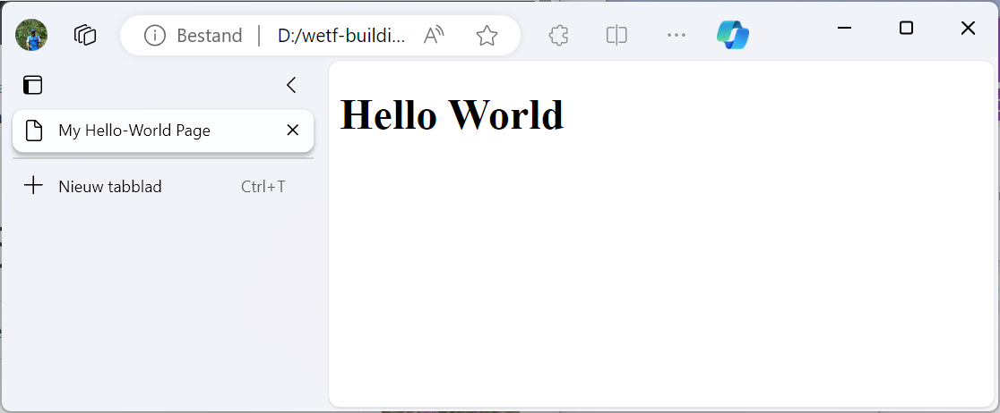

# Web Development Basics

The "web" part of the internet works by having web browsers like:
Microsoft Edge, Mozilla Firefox, Google Chrome and many others,
request webpages from servers, and rendering the result in a (generally) readable format.
This happens according to the
[client server model](https://developer.mozilla.org/en-US/docs/Learn/Server-side/First_steps/Client-Server_overview).
In short: a client, like a browser, sends a request to a server.
Let's say, it's requesting the homepage from Google.
Google will respond, and send back the requested webpage, which is then rendered by the browser.
The reponse from the server is the focus of this document.
What exactly is being send over to the browser? What do these files include?
How can we start building simple websites using this knowledge?

## Table of Contents

1. [Webpages](#webpages)
    1. [Structure](#structure)
        1. [A Basic Website](#a-basic-website)
    2. [Styling](#styling)
    3. [Functionality](#functionality)

## Webpages

A webpage, after being requested, is send to the browser as HTML, CSS and JavaScript files.
[HTML (HyperText Markup Language)](https://developer.mozilla.org/en-US/docs/Web/HTML)
files are used to define the structure of a page, it defines what is being displayed;
[CSS (Cascading Style Sheets)](https://developer.mozilla.org/en-US/docs/Web/CSS)
files are used to define styling, they define how things are being displayed.
[JavaScript](https://developer.mozilla.org/en-US/docs/Web/JavaScript)
files are used to add interaction to an otherwise static webpage.

> **Webpages or Websites**.
> The term *website* refers to an entire website. It is a collection of webpages.
> A *webpage* is a term used to refer to a single page.
> For example, the [Open Day](https://hz.nl/en/calendar/hz-open-day) webpage,
> is part of the [HZ](https://hz.nl/en/) website.

### Structure

The first thing to do, is to define the structure of the webpage.
During this step, HTML code is used to define the content of a page.
Why is this chapter called structure?
HTML defines the content of a page, refered to as
[elements](https://developer.mozilla.org/en-US/docs/Web/HTML/Element).
In addition, it also defines the
[order](https://developer.mozilla.org/en-US/docs/Learn/HTML/Introduction_to_HTML/Document_and_website_structure)
of the elements, [properties](https://developer.mozilla.org/en-US/docs/Web/HTML/Attributes)
of elements, and [role](https://developer.mozilla.org/en-US/docs/Web/HTML/Content_categories)
of the elements.

#### A Basic Website

Lets start by creating a very basic website, a true phenomenon amongst programmers:
the hello world website. In order to get started, create a folder for the site.
Within the folder, a file should be created with the extension `.html`.
This makes the file an HTML file; just like `.txt` turns a file into a text file,
or how `.png` turns a file into an image. The contents of the file should be:

```html
hello world!
```

Dubble click the file in a file explorer to open it in the default browser.
The webpage appears, and displays the text as expected.
This can be seen in the image below.
However, there has been a little bit of cheating.
The file simply contains the text, there is no structure to be found.
Let's fix that.



Structure, although mostly invisible to the end-user,
is vital for the accessibility of webpages.
Screen-readers use the structure of a webpage to determine how things should be presented,
the browser uses the structure of the website to allow ease-of-use, like keyboard controls.
In HTML, tags are used to define this structure.

The first tag is going to be the [html-tag](https://www.w3schools.com/tags/tag_html.asp).
This tag represents the root, or start, of the webpage.
The tag is opened using an opening-tag like: `<html>`, and closed with a closing-tag like: `</html>`.
Above it is the [!DOCTYPE-tag](https://www.w3schools.com/tags/tag_doctype.asp).
This defines what kind of document is presented. Since this is plain HTML, the following will suffice:

```html
<!DOCTYPE html>

<html>
  Hello World
</html>
```

Our structure however, is not done yet. In order for a browser to process a page,
certain meta-information is used to describe the document.
This is placed in the document [head](https://developer.mozilla.org/en-US/docs/Web/HTML/Element/head).
Meta-information is not meant to be seen by a user, but is used for processing purposes.
Some exceptions exist, like the [title-tag](https://www.w3schools.com/tags/tag_title.asp),
which can be seen in the tab of the page.

```html
<!DOCTYPE html>

<html>
  <head>
    <meta charset="UTF-8" />
    <meta name="viewport" content="width=device-width" />

    <title>My Hello-World Page</title>
  </head>

  Hello World
</html>
```

Two other pieces of meta-information can be seen in the example above.
They are presented in [meta-tags](https://www.w3schools.com/tags/tag_meta.asp).
The [charset](https://www.w3schools.com/tags/att_meta_charset.asp)
tells the browsers how to read the characters in the document;
[viewport](https://www.w3schools.com/tags/att_meta_name.asp)
makes the width of the page equal to the current device,
which is (almost) required for proper viewing of the page on a mobile device.
Notice that meta-tags are self-closing-tags,
the closing `/` is found at the end of the tag.

The last stap in defining the structure of the page, is to define the body.
The body is the actual content of the page, and is placed inside a
[body-tag](https://www.w3schools.com/tags/tag_body.asp).
In order to make `Hello World` a title,
the [hn-tag](https://www.w3schools.com/tags/tag_hn.asp) is used.
In this case, `<h1>`, since this is the main title of the page.

```html
<!DOCTYPE html>

<html>
  <head>
    <meta charset="UTF-8" />
    <meta name="viewport" content="width=device-width" />

    <title>My Hello-World Page</title>
  </head>

  <body>
    <h1>Hello World</h1>
  </body>
</html>
```



### Styling

### Functionality
